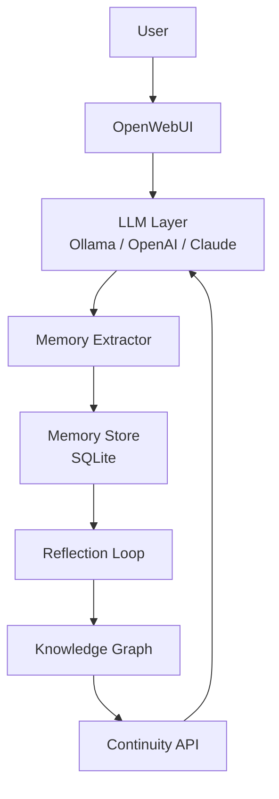

# AILEXSI

**The Continuity Layer for AI Systems**

Most AI systems suffer from amnesia.

AILEXSI provides a **memory, reflection and continuity layer** for local and cloud-based language models.

The goal is not to build a smarter AI.

The goal is to build an AI that **remembers why it said what it said**.

---

## Leitprinzip

Most AI systems optimize intelligence.

**AILEXSI optimizes continuity.**

An answer lasts seconds.  
A decision lasts months.  
A project lasts years.

**AILEXSI is built for the things that last.**

## Vision

Current AI systems are intelligent but discontinuous.

They can reason. They can code. They can plan.

But they rarely remember.

AILEXSI introduces:

- **Structured Memory**
- **Reflection Loops**
- **Project Continuity**
- **Knowledge Evolution**
- **Cross-Model Context**

The model becomes replaceable.  
The memory becomes persistent.  
**The continuity becomes the product.**

## Core Memory Types

- **Decision**: A conscious choice made.
- **Hypothesis**: An assumption not yet verified.
- **Insight**: A meaningful realization.
- **Project**: A persistent objective.
- **Task**: An actionable item.
- **Question**: An unresolved inquiry.
- **Fact**: Verified information.
- **Relation**: A connection between memories.

## Quick Start

```bash
pip install ailexsi
```

```python
from ailexsi import AilexsiCore

core = AilexsiCore(project="AILEXSI_CORE", db_path="ailexsi.db")

# Extract and store from conversation
core.extract_and_store("I chose SQLite over PostgreSQL because of simplicity for local use.")

# Retrieve context
context = core.get_continuity_context("database_choice")
print(context)
```

See [examples/](examples/) for OpenWebUI, Ollama and CLI integrations.

## Architecture



## Project Status

- **v0.1** (Current): SQLite backend, basic extractor, search
- Full roadmap in [docs/roadmap.md](docs/roadmap.md)

## Repository Structure

See detailed structure in [docs/architecture.md](docs/architecture.md)

## Philosophy

Continuity as Infrastructure.  
In five years, persistent memory across model changes will matter more than marginal benchmark gains.

---

**License**: MIT  
**Made with ❤️ for the long game**